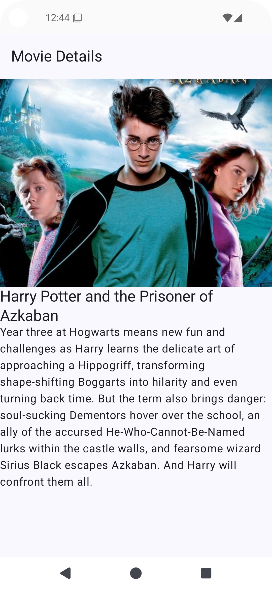

# 🎬 MovieSearch Android App

<div style="text-align: center;">


**A modern Android application built with Jetpack Compose for searching and viewing movie
information.**

*Clean architecture • Modern UI • Latest Android practices*

</div>

---

## ✨ Features

- 🔍 **Search for movies** - Find your favorite movies instantly
- 📱 **View detailed movie information** - Get comprehensive movie details
- 🎨 **Modern UI built with Jetpack Compose** - Beautiful, responsive interface
- 🏗️ **Clean architecture with modular design** - Maintainable and scalable code
- 💉 **Dependency injection with Dagger 2** - Efficient dependency management
- 🌐 **Network requests with Retrofit** - Reliable API communication
- 📄 **JSON serialization with Kotlinx Serialization** - Fast data parsing

## 📸 Screenshots

<div style="text-align: center;">

|  |  |
|:---------------------------------------------:|:-----------------------------------------------:|
|            **Movie Search Screen**            |            **Movie Details Screen**             |

</div>

## 🏗️ Architecture

The app follows **Clean Architecture** principles with a multi-module structure:

```
📦 MovieSearch
├── 🏠 app                    # Main application module
├── 🎬 feature/movie          # Movie search functionality
├── 📋 feature/movie_details  # Movie details functionality
├── 🔧 core/common           # Common utilities and components
├── 🔌 core/feature_api      # Feature API definitions
└── 🌐 core/network          # Network layer
```

## 📚 Libraries Used

### 🚀 Core Libraries

| Library                                                                                                 | Version    | Description                   |
|---------------------------------------------------------------------------------------------------------|------------|-------------------------------|
|             | 2.0.21     | Primary programming language  |
|              | 8.10.0     | Build system                  |
|  | 2024.09.00 | Modern UI toolkit             |
|        | 1.16.0     | Kotlin extensions for Android |

### 🎨 UI & Navigation

| Library                                                                                                       | Version | Description                       |
|---------------------------------------------------------------------------------------------------------------|---------|-----------------------------------|
|    | Latest  | Material Design 3 components      |
|  | 2.9.0   | Navigation for Compose            |
|              | 1.10.1  | Activity integration with Compose |
|                         | 3.2.0   | Image loading for Compose         |

### 💉 Dependency Injection

| Library                                                                                       | Version | Description                    |
|-----------------------------------------------------------------------------------------------|---------|--------------------------------|
|  | 2.56.2  | Dependency injection framework |
|           | 0.8.1   | Assisted injection for Dagger  |

### 🌐 Network

| Library                                                                                                        | Version | Description             |
|----------------------------------------------------------------------------------------------------------------|---------|-------------------------|
|              | 2.11.0  | HTTP client             |
|                    | 4.12.0  | Network request logging |
|  | 1.8.1   | JSON serialization      |

## 📋 Requirements

- 📱 **Android API 24+** (Android 7.0+)
- 🎯 **Target SDK:** 35
- 🔧 **Kotlin:** 2.0.21
- 🛠️ **Android Studio:** Koala or newer

## 🚀 Installation

1. **Clone the repository**
   ```bash
   git clone [repository-url]
   ```

2. **Open the project in Android Studio**

3. **Build and run the project**

## 📄 License

```
MIT License

Copyright (c) 2025 MovieSearch

Permission is hereby granted, free of charge, to any person obtaining a copy
of this software and associated documentation files (the "Software"), to deal
in the Software without restriction, including without limitation the rights
to use, copy, modify, merge, publish, distribute, sublicense, and/or sell
copies of the Software, and to permit persons to whom the Software is
furnished to do so, subject to the following conditions:

The above copyright notice and this permission notice shall be included in all
copies or substantial portions of the Software.

THE SOFTWARE IS PROVIDED "AS IS", WITHOUT WARRANTY OF ANY KIND, EXPRESS OR
IMPLIED, INCLUDING BUT NOT LIMITED TO THE WARRANTIES OF MERCHANTABILITY,
FITNESS FOR A PARTICULAR PURPOSE AND NONINFRINGEMENT. IN NO EVENT SHALL THE
AUTHORS OR COPYRIGHT HOLDERS BE LIABLE FOR ANY CLAIM, DAMAGES OR OTHER
LIABILITY, WHETHER IN AN ACTION OF CONTRACT, TORT OR OTHERWISE, ARISING FROM,
OUT OF OR IN CONNECTION WITH THE SOFTWARE OR THE USE OR OTHER DEALINGS IN THE
SOFTWARE.
```

---

<div style="text-align: center;">

**Made with ❤️ and ☕ using Android & Kotlin**

⭐ Star this repository if you found it helpful!

</div>
